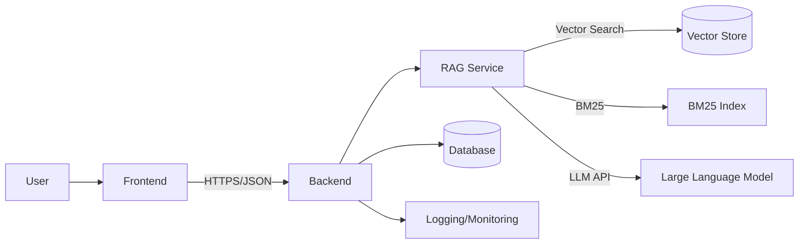

# Retrieval-Augmented Generation (RAG) Application

## 1. Overview & Purpose
The RAG application delivers domain-aware answers by combining knowledge retrieval with large language model generation.  It allows organisations to ingest internal documents, search them semantically, and obtain contextualised responses that include citations to original sources.  A single environment variable (`APP_DOMAIN`) adjusts prompts, guardrails, and retrieval defaults so the same codebase can support manufacturing, healthcare, finance, hospitality, or legal use cases without modification.

## 2. Architecture
### 2.1 End-to-End Flow

### 2.2 Components
#### Frontend
- **Framework** – React + TypeScript + Vite with Tailwind CSS styling.
- **UI/UX** – chat interface, dashboards for collections/documents/users, and settings to tune retrieval parameters.
- **State Management** – Zustand stores for auth, chat sessions, messages, and UI preferences (top‑`k`, MMR, temperature, compact mode, image display).
- **Query Handling** – questions are posted to `/api/ask`; streaming responses render incrementally with citation chips and feedback controls.
- **Logging Views** – admin pages display ingestion status, collection statistics, and user records with toast/inline error messaging.

#### Backend
- **Framework** – FastAPI with routers for authentication, chat, documents, collections, metrics, health checks, and admin functions.
- **Authentication** – email/password login issues JWTs; role-based access (`user`, `admin`, `superadmin`) enforced on routes.
- **Ingestion Pipeline** – uploaded files are stored under `data/raw`, chunked, embedded, and indexed into ChromaDB with optional BM25 indexes. Progress and errors persist for dashboard consumption.
- **Logging & Auditing** – query events append to `logs/queries.log`; document operations are tracked in `logs/audit.log` with correlation IDs.
- **Error Handling** – guardrails validate inputs and model outputs; descriptive HTTP errors and correlation IDs aid tracing.

#### AI/ML Service
- **Domain Configuration** – `rag/domain_config.py` loads industry prompts, guardrails, retrieval defaults, disclaimers, and citation rules.
- **Embeddings** – pluggable `EmbeddingClient` supports OpenAI or sentence-transformer models with a SQLite cache to deduplicate calls.
- **Retrieval** – `rag/retriever.py` executes vector search over ChromaDB, can fuse BM25 results via Reciprocal Rank Fusion, reranks with a cross-encoder, and applies Maximal Marginal Relevance for diversity.
- **Generation** – `rag/answerer.py` rewrites questions, optionally compresses context, invokes OpenAI’s Chat Completions API, and returns deduplicated citations.
- **Memory** – recent conversation turns and persisted user memories augment retrieval for personalised context.

#### Infrastructure
- **Database** – SQLAlchemy models with SQLite by default; configurable to external engines via `SQLALCHEMY_DATABASE_URI`.
- **Vector Store** – per-collection ChromaDB instances under `data/chroma/coll_<id>` with optional BM25 indexes under `data/bm25`.
- **File Storage** – content-addressed blobs in `data/raw`; log files under `logs/`.
- **Deployment** – environment variables configure API keys, retrieval behaviour, CORS origins, and domain selection. Containers can be orchestrated via Docker Compose or Kubernetes.

## 3. Core Features
### Retrieval & Generation
1. **Hybrid Retrieval** – combines dense vector similarity with optional BM25 lexical search, cross-encoder reranking, and MMR diversification.
2. **Contextual Generation** – LLM responses include source citations and respect domain-specific guardrails.
3. **Feedback Loop** – users rate answers; events log for evaluation and UX tuning.

### Frontend Features
- Secure chat with session management and streaming answers.
- Dashboards for collections and documents with role-aware access control.
- Inline error handling and logging views for administrators.

### Backend Features
- Modular FastAPI routers, JWT authentication, ingestion pipelines, and comprehensive logging/auditing.
- Health and metrics endpoints for observability.

### Infrastructure Features
- SQLite/ChromaDB storage, optional BM25 indexes, and environment-driven configuration.
- Deployment flexibility across local, cloud, or on-premise environments.

## 4. System Workflows
### 4.1 User Query Flow
1. User authenticates via `/api/auth/login` and obtains a JWT.
2. Frontend submits the question to `/api/ask` with the token.
3. RAG service rewrites the query, retrieves relevant chunks, augments with memories, and invokes the LLM.
4. Answer streams back with citations; user can provide thumbs‑up/down feedback.

### 4.2 Document Ingestion Flow
1. Admin uploads or links a document from the dashboard.
2. Backend stores the blob, extracts text, chunks content, and generates embeddings.
3. Chunks upsert into the collection’s vector store and optional BM25 index.
4. Progress and errors are logged and surfaced via status endpoints and dashboards.

### 4.3 Logging & Monitoring Flow
- Query events and feedback append to `logs/queries.log`.
- Document operations write to `logs/audit.log`.
- `/api/metrics`, `/api/health`, and `/api/ready` expose operational insights for administrators.

## 5. AI/ML Components
- **Embedding Models** – support for OpenAI or local sentence-transformers; cosine similarity used for vector search.
- **Similarity & Reranking** – Reciprocal Rank Fusion blends dense and lexical results; cross-encoder reranker refines ordering.
- **Generation Pipeline** – OpenAI Chat Completions API with optional context compression and guardrails.
- **Scalability** – hybrid retrieval enables fallbacks; embeddings cached; RAG service can scale horizontally or run on GPU hardware.

## 6. API Endpoints & Integration Points
### 6.1 Endpoint Summary
| Method | Path | Description |
| --- | --- | --- |
| POST | `/api/auth/login` | Obtain JWT token |
| GET | `/api/chat/sessions` | List chat sessions |
| POST | `/api/chat/sessions` | Create a session |
| GET | `/api/chat/sessions/{id}/history` | Retrieve message history |
| POST | `/api/ask` | Execute RAG pipeline |
| POST | `/api/queries/{id}/feedback` | Submit answer feedback |
| GET | `/api/admin/collections` | List collections |
| POST | `/api/admin/collections` | Create collection |
| POST | `/api/admin/collections/{id}/documents` | Upload document |
| GET | `/api/admin/documents/{id}/status` | Check ingestion status |
| PATCH | `/api/admin/users/{id}` | Update user or role |
| PATCH | `/api/admin/users/{id}/prefs` | Update user preferences |
| GET | `/api/health` | Liveness probe |
| GET | `/api/metrics` | Service metrics |

### 6.2 External Integrations
- **Vector DB** – ChromaDB for dense retrieval; Whoosh provides BM25 indexes.
- **Authentication** – JWT tokens handled client-side with refresh on login.
- **Logging** – file-based logs can be shipped to ELK, OpenTelemetry collectors, or cloud monitoring.

## 7. Scalability & Future Readiness
- Role-based access and collection-level permissions support multi-tenant deployments.
- Modular pipelines allow swapping embedding models, retrievers, or LLM providers.
- Containers can scale independently (frontend, backend, RAG service) and run on cloud or on-prem infrastructure.
- Roadmap: expand to multimodal inputs, domain-specific models, advanced analytics dashboards, and structured log export.

